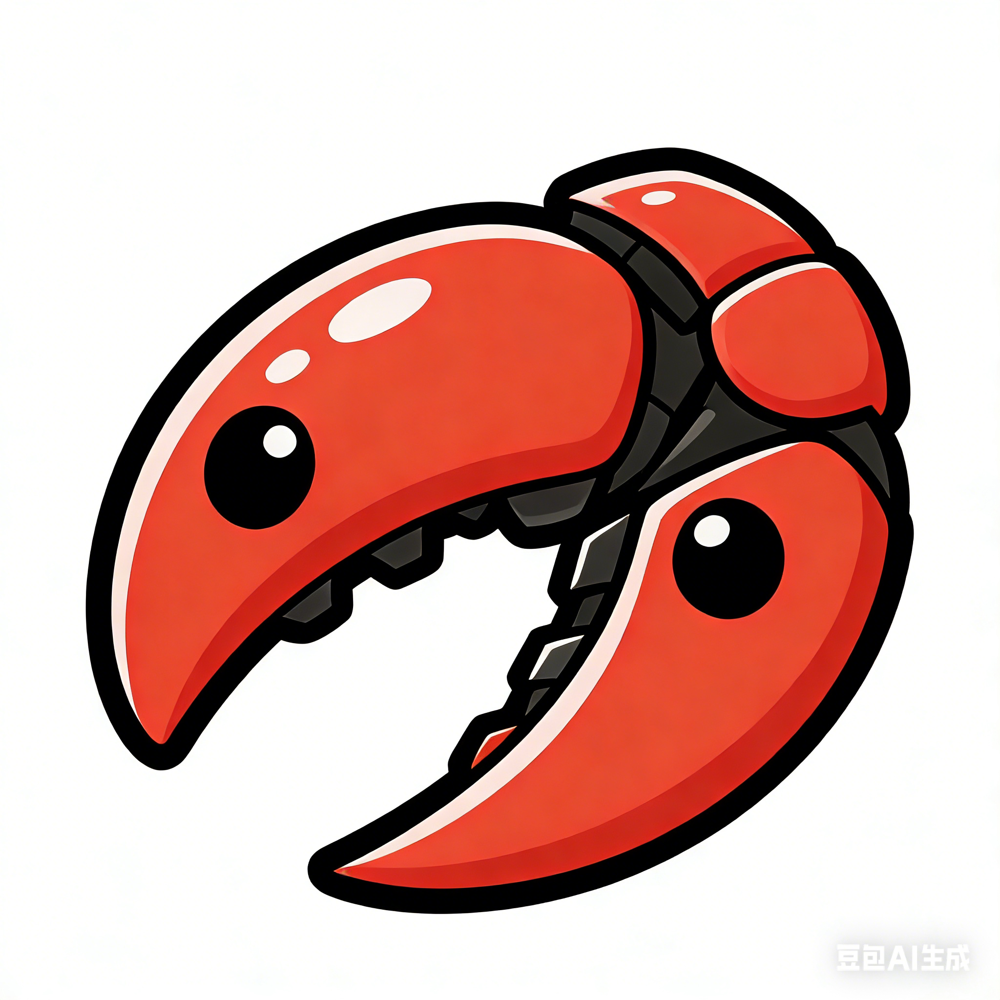
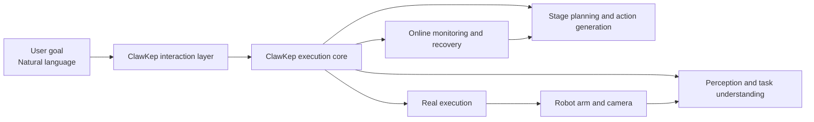
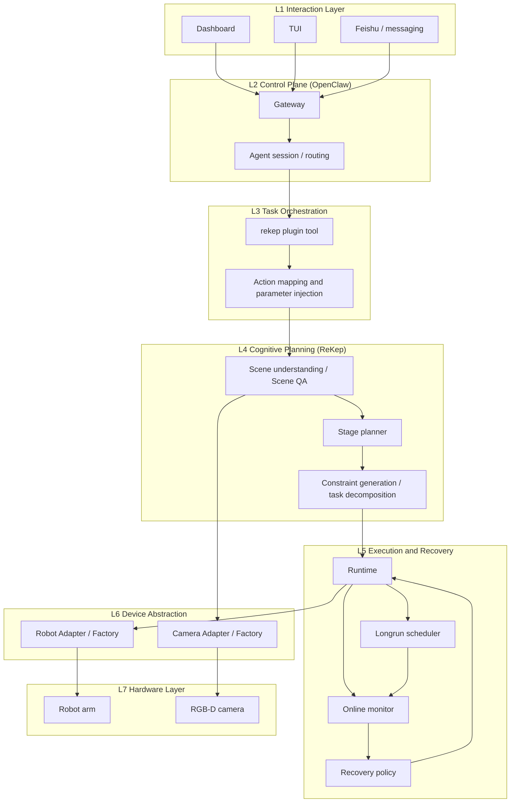
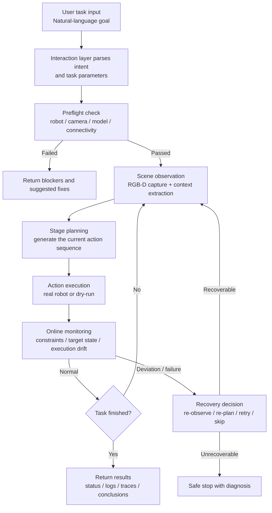

#  ClawKep: A General Vision-Language-Action Agent for Long-Horizon Manipulation

<p align="center">
  <strong>From natural-language intent to real-world robot execution in one continuous loop.</strong>
</p>

<p align="center">
  <a href="https://paper">Paper</a> ·
  <a href="https://applink.feishu.cn/">Feishu Community</a>
</p>

<p align="center">
  <a href="./README.md"><strong>English</strong></a> ·
  <a href="./README_zh.md">简体中文</a>
</p>

---

## What Is ClawKep

`ClawKep` is a **complete and runnable vision-language-action agent system**:

1. Users provide only the task goal. They do not need to manually orchestrate the low-level execution chain.
2. The agent automatically closes the loop of `perception -> planning -> execution -> monitoring -> recovery`.
3. It is designed for real robots, with a strong focus on long-horizon tasks and mid-task recovery.

One-line definition:

> **ClawKep = a general vision-language-action agent that can keep executing real-world manipulation tasks and continue making progress after failures.**

---

## What You Can Do With It

### For operators

- Issue manipulation tasks in natural language: pick, place, organize, and multi-stage tasks.
- Ask scene questions during execution.
- Interrupt the task mid-run: pause, re-plan, replace the current subtask, or resume.

### For system builders

- Connect real robot arms and cameras through a unified interface.
- Manage sessions, logs, task state, and recovery policies through one runtime.
- Extend the system to more robot platforms and more complex tasks without rewriting the whole stack.

---

## ClawKep at a Glance



---

## System Design: Layered ClawKep Architecture



This layered design is what makes ClawKep a full system rather than a loose collection of scripts:

1. The upper layers care about task goals, while the lower layers handle execution and recovery.
2. Cognition, execution, and recovery form one continuous loop inside the same system.
3. Hardware differences are isolated behind abstraction layers, making new robots and cameras easier to add.

Layer summary:

1. **L1 Interaction Layer**: receives user intent and returns results.
2. **L2 Control Plane**: manages sessions, routing, policies, and tool invocation.
3. **L3 Task Orchestration**: maps natural-language tasks into executable requests.
4. **L4 Cognitive Planning**: handles scene understanding, staging, constraints, and action generation.
5. **L5 Execution and Recovery**: executes actions, monitors progress, and recovers automatically when needed.
6. **L6 Device Abstraction**: unifies robot and camera interfaces behind stable contracts.
7. **L7 Hardware Layer**: the real robot arm and the real sensors.

---

## Unified Interface: One Protocol for Multiple Robot Arms

ClawKep **defines a unified interface first, then plugs in specific robot backends**.

Unified robot interface (`RobotAdapter`):

1. `connect()`
2. `close()`
3. `get_runtime_state()`
4. `execute_action(action, execute_motion=False)`

Unified action semantics:

1. `movej` (joint space)
2. `movel` (Cartesian space)
3. `open_gripper`
4. `close_gripper`
5. `wait`

This means:

1. Upper-layer planning and recovery do not need to know the specific robot SDK.
2. A new robot only needs interface mapping instead of a full system rewrite.
3. The same task logic can run on different robot backends with lower migration cost.

Current status and intended expansion:

1. Current validated release path: `Dobot`
2. Interface-level expansion targets: `Kinova / Franka / Aloha`

---

## Full Task Flow: Interaction -> Execution -> Recovery



Core value of this flow:

1. The user provides only the goal, not a step-by-step control script.
2. Execution is continuously checked instead of relying on a one-shot offline plan.
3. Recovery is attempted before the system gives up.

---

## Quick Start

> The commands below assume you are at the project root.

### 1) Install OpenClaw and prepare the `openclaw` conda environment

```bash
# If the environment does not exist yet, create one with nodejs / npm included
conda create -n openclaw python=3.11 nodejs npm -y

# Install the OpenClaw CLI
./openclaw-runtime/bin/setup-openclaw-local
```

### 2) Install the `rekep` conda environment

```bash
# If the environment does not exist yet, create it from the repo environment file
conda env create -f ReKep/environment.rekep.yml

# Install the extra dependencies required by ClawKep / ReKep
./openclaw-runtime/bin/setup-rekep-local

# Optional dependencies
conda run -n rekep pip install -r ReKep/requirements.rekep-optional.txt
```

### 3) Start the gateway (Terminal 1)

```bash
# The robot is accessed through a remote ZMQ service, so the OpenClaw host and
# the robot host should be on the same reachable network.

# Start Tailscale if needed
sudo tailscale up

# Use GPU for SAM refinement
export REKEP_KEYPOINT_FINE_SAM_DEVICE="cuda"

# Activate the OpenClaw environment
conda activate openclaw

# Set ClawKep runtime environment variables
export REKEP_KEYPOINT_VLM_MODEL="openai/gpt-5.4"
export REKEP_KEYPOINT_VLM_BASE_URL="https://openrouter.ai/api/v1"
export DMXAPI_API_KEY="<YOUR_DMXAPI_API_KEY>"
export REKEP_KEYPOINT_VLM_API_KEY="<YOUR_VLM_API_KEY>"
export OPENCLAW_STATE_DIR=<PROJECT_ROOT>/openclaw-runtime/state
export OPENCLAW_CONFIG_PATH=<PROJECT_ROOT>/openclaw-runtime/state/openclaw.json
export REKEP_EXECUTION_MODE=vlm_stage
# If you must use solver (DINO), keep MeanShift parallelism low to avoid OOM.
export REKEP_MEANSHIFT_N_JOBS=1

# Start the OpenClaw gateway
openclaw gateway
```

### 4) Open the interaction UI (Terminal 2)

```bash
export OPENCLAW_STATE_DIR=<PROJECT_ROOT>/openclaw-runtime/state
export OPENCLAW_CONFIG_PATH=<PROJECT_ROOT>/openclaw-runtime/state/openclaw.json

openclaw tui
# or
openclaw dashboard
```

### 5) Send tasks directly

Example natural-language commands:

- `Check the real robot and camera environment, and report any blockers.`
- `Start the standby video stream for the robot.`
- `Execute the task: pick up the pen on the table and place it into the holder. Dry-run first.`
- `Execute real robot motion: pick up the chili pepper and place it into the plate.`

### Quick Troubleshooting for Real Execute Freezes

If the machine freezes after issuing `Execute real robot motion: pick up the chili pepper and place it into the plate.`:

1. Check for OOM first:

```bash
journalctl --since "10 min ago" | rg -i "oom|killed process"
```

2. Prefer the lighter backend:

```bash
export REKEP_EXECUTION_MODE=vlm_stage
```

3. If solver (DINO) is required, cap MeanShift workers:

```bash
export REKEP_EXECUTION_MODE=solver
export REKEP_MEANSHIFT_N_JOBS=1
```

4. Refresh potentially stale running job status:

```bash
conda run -n rekep python ReKep/dobot_bridge.py job_status \
  --state_dir <PROJECT_ROOT>/openclaw-runtime/state/rekep/real \
  --job_id <JOB_ID>
```

---

## Recommended Real-World Usage Flow

1. **Preflight**: confirm robot, camera, model, and connectivity status.
2. **Observe**: start the standby stream and ask what the current scene contains.
3. **Trial run**: do a dry-run first and verify the generated actions.
4. **Execute**: explicitly authorize real motion.
5. **Long tasks**: use longrun when you want mid-task intervention.
6. **Recovery**: if there is drift, occlusion, or loss of target, the system attempts recovery automatically.

---

## How to Adapt a New Robot Quickly

Goal: get your own robot connected to ClawKep as quickly as possible and make the loop `preflight -> perception -> execution -> recovery` work end-to-end.

### Path A (fastest landing): reuse a remote RPC protocol

This path is suitable when you already have a robot control service and want the shortest route to integration.

You only need to expose these RPC capabilities:

1. `num_dofs`
2. `get_joint_state`
3. `command_joint_state`
4. `command_movel`
5. `command_gripper`
6. `set_do_status`
7. `get_XYZrxryrz_state`

Integration steps:

1. Start the robot service on the robot host, for example on port `6001`.
2. Start the RGB-D streaming service on the camera host, for example on port `7001` with topic `realsense`.
3. Run a parameterized preflight check on the ClawKep host:

```bash
conda run -n rekep python ReKep/dobot_bridge.py preflight \
  --dobot_driver xtrainer_zmq \
  --dobot_host <ROBOT_HOST> \
  --dobot_port 6001 \
  --camera_source "realsense_zmq://<CAMERA_HOST>:7001/realsense" \
  --camera_profile global3 \
  --camera_serial <YOUR_CAMERA_SERIAL> \
  --pretty
```

4. Verify the execution chain with a dry-run first:

```bash
conda run -n rekep python ReKep/dobot_bridge.py execute \
  --instruction "Pick up the target and place it in the specified area" \
  --dobot_driver xtrainer_zmq \
  --dobot_host <ROBOT_HOST> \
  --dobot_port 6001 \
  --camera_source "realsense_zmq://<CAMERA_HOST>:7001/realsense" \
  --camera_profile global3 \
  --camera_serial <YOUR_CAMERA_SERIAL> \
  --pretty
```

5. After safety checks, enable real execution:

```bash
conda run -n rekep python ReKep/dobot_bridge.py execute \
  --instruction "Pick up the target and place it in the specified area" \
  --execute_motion \
  --dobot_driver xtrainer_zmq \
  --dobot_host <ROBOT_HOST> \
  --dobot_port 6001 \
  --camera_source "realsense_zmq://<CAMERA_HOST>:7001/realsense" \
  --camera_profile global3 \
  --camera_serial <YOUR_CAMERA_SERIAL> \
  --pretty
```

### Path B (standard engineering path): Robot/Camera Factory

This path is suitable when you want long-term maintainability, support multiple robot models, or open-source your hardware integration layer later.

Full adaptation guide: [`docs/robot_adaptation.md`](docs/robot_adaptation.md)

---

## Roadmap

- [x] Dobot robot arm support
- [x] Pick-and-place operations
- [ ] Articulated object manipulation (doors, lids, etc.)
- [ ] Sliding object manipulation (drawers, rails)
- [ ] Rotational object manipulation (knobs, twist actions)
- [ ] Long-horizon planning and failure recovery
- [ ] Streaming interruption control (human-in-the-loop interaction)
- [ ] Dual-arm coordination
- [ ] More robot backends: Kinova / Franka / Aloha
- [ ] Mobile manipulation (base + arm)

---

## Typical Scenarios

### 1) Long-horizon tabletop organization

"Continuously organize the tabletop, put the pen into the holder, and recover automatically from execution drift."

### 2) Real-time perception + execution

"What objects are in the current view?" -> "Pick up the white pen and place it into the black pen holder."

### 3) Human-robot collaboration

During execution: "Pause. Handle the object on the left first, then continue."
