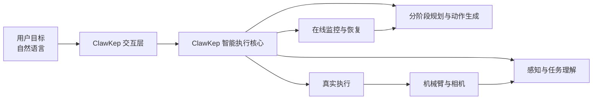
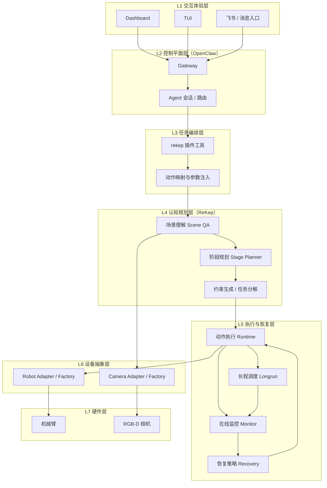
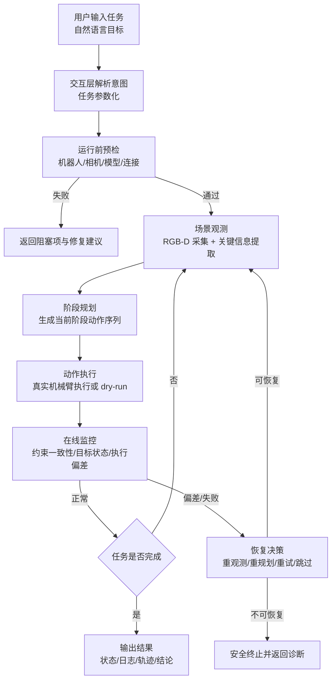

#  ClawKep：面向长程操作任务的通用视觉语言动作智能体

<p align="center">
  <strong>从自然语言到真实操作，一条连续闭环。</strong>
</p>

<p align="center">
  <a href="https://paper">Paper</a> ·
  <a href="https://applink.feishu.cn/">飞书交流群</a>
</p>

<p align="center">
  <a href="./README.md">English</a> ·
  <a href="./README_zh.md"><strong>简体中文</strong></a>
</p>

---

## 🤖 ClawKep 是什么

`ClawKep` 是一个**完整的、可运行的视觉语言动作智能体**：

1. 用户只需要说任务目标，不需要手动编排底层执行链。
2. 智能体会自动完成“感知 -> 规划 -> 执行 -> 监控 -> 恢复”闭环。
3. 面向真实机器人场景，重点支持超长任务（long-horizon）与中途恢复。

一句话定义：

> **ClawKep = 一个可以持续执行真实世界操纵任务、并能在失败后继续推进的通用视觉语言动作智能体。**

---

## 🧰 你可以直接用它做什么

### 面向操作者

- 用自然语言下达操纵任务（抓取、放置、整理、连续任务）。
- 在执行中实时提问当前画面（scene QA）。
- 在任务中途插话：暂停、改计划、替换当前子任务、继续执行。

### 面向系统部署者

- 以统一接口接入真实机械臂与相机。
- 通过同一套运行时管理会话、日志、任务状态、恢复策略。
- 平滑扩展到更多机械臂平台与复杂任务类型。

---

## 👀 一张图看懂 ClawKep



---

## 🏗️ 框架设计（ClawKep 分层）



这套分层体现了 ClawKep 的完整性：

1. 上层只关心“任务目标”，下层负责“可执行闭环”。
2. 认知、执行、恢复是同一系统内连续回路，不依赖人工拼接。
3. 设备差异被封装在抽象层，支持持续扩展新机器人与新相机。

各层职责简述：

1. **L1 交互体验层**：承接用户目标与反馈结果。
2. **L2 控制平面层**：管理会话、路由、策略与工具调用入口。
3. **L3 任务编排层**：把自然语言任务映射为可执行动作请求。
4. **L4 认知规划层**：完成场景理解、阶段规划、约束与动作生成。
5. **L5 执行与恢复层**：执行动作并在线监控，失败时自动恢复与重规划。
6. **L6 设备抽象层**：统一机器人/相机接口，屏蔽硬件 SDK 差异。
7. **L7 硬件层**：真实机械臂与真实传感器。

---

## 🔌 统一接口：一套协议适配多种机械臂

ClawKep **先定义统一接口，再接入具体机械臂**。

统一机器人接口（`RobotAdapter`）：

1. `connect()`
2. `close()`
3. `get_runtime_state()`
4. `execute_action(action, execute_motion=False)`

统一动作语义（与机械臂品牌解耦）：

1. `movej`（关节空间）
2. `movel`（笛卡尔空间）
3. `open_gripper`
4. `close_gripper`
5. `wait`

这意味着：

1. 上层规划与恢复逻辑无需关心底层硬件类型。
2. 新机械臂只需完成接口映射，不需要重写任务编排和恢复系统。
3. 同一任务可在不同机械臂后端复用，降低迁移成本。

当前状态与扩展方向：

1. 当前发布版主线验证：`Dobot`
2. 接口级兼容扩展目标：`Kinova / Franka / Aloha`（按同一契约接入）

---

## 🔄 交互 -> 执行 -> 失败恢复：任务全流程



这张图对应 ClawKep 的核心价值：

1. 用户只管目标，不需要手工控制每一步。
2. 执行过程持续自检，不是“一次规划跑到底”。
3. 发生失败时优先自动恢复，恢复失败才终止。

---

## 🚀 快速上手（最短路径）

> 以下命令默认在项目根目录执行。

### 1) 安装 OpenClaw 并准备 `openclaw` conda 环境

```bash
# 如环境不存在，先创建一个包含 nodejs / npm 的 openclaw 环境
conda create -n openclaw python=3.11 nodejs npm -y

# 安装 OpenClaw CLI
./openclaw-runtime/bin/setup-openclaw-local
```

### 2) 安装 `rekep` conda 环境

```bash
# 如环境不存在，按仓库环境文件创建
conda env create -f ReKep/environment.rekep.yml

# 安装 ClawKep / ReKep 运行所需的额外依赖
./openclaw-runtime/bin/setup-rekep-local

# 可选依赖
conda run -n rekep pip install -r ReKep/requirements.rekep-optional.txt
```

### 3) 启动网关（终端 1）

```bash
# 使用zmq机械臂远端，因此，将openclaw主机和机械臂主机放在同一局域网下
# 启动 tailscale
sudo tailscale up
# 设置SAM的GPU环境变量
export REKEP_KEYPOINT_FINE_SAM_DEVICE="cuda"
# 启动 openclaw conda 环境
conda activate openclaw
# 设置 clawkep 环境变量
export REKEP_KEYPOINT_VLM_MODEL="openai/gpt-5.4"
export REKEP_KEYPOINT_VLM_BASE_URL="https://openrouter.ai/api/v1"
export DMXAPI_API_KEY="你的APIKey"
export REKEP_KEYPOINT_VLM_API_KEY="你的APIKey"
export OPENCLAW_STATE_DIR=<PROJECT_ROOT>/openclaw-runtime/state
export OPENCLAW_CONFIG_PATH=<PROJECT_ROOT>/openclaw-runtime/state/openclaw.json
export REKEP_EXECUTION_MODE=vlm_stage
# 如果必须使用 solver(DINO)，建议强制降低并发，避免 OOM 卡死
export REKEP_MEANSHIFT_N_JOBS=1
# 启动 openclaw 网关
openclaw gateway
```

### 4) 打开交互界面（终端 2）

```bash
export OPENCLAW_STATE_DIR=<PROJECT_ROOT>/openclaw-runtime/state
export OPENCLAW_CONFIG_PATH=<PROJECT_ROOT>/openclaw-runtime/state/openclaw.json

openclaw tui
# 或者
openclaw dashboard
```

### 5) 直接下达任务

示例自然语言：

- `检查真实机械臂与相机环境，并返回阻塞项。`
- `启动机械臂待机视频流。`
- `执行任务：抓取桌上的笔并放入笔筒。先 dry-run。`
- `执行真实机械臂运动：抓取辣椒并放到盘子里面。`

### 真实执行“卡死”快速排查

如果执行 `执行真实机械臂运动：抓取辣椒并放到盘子里面。` 后整机卡顿/无响应，优先按下面检查：

1. 先看是否是 OOM（内存打满）：

```bash
journalctl --since "10 min ago" | rg -i "oom|killed process"
```

2. 若看到 OOM，优先切到轻量后端：

```bash
export REKEP_EXECUTION_MODE=vlm_stage
```

3. 若必须用 `solver`（DINO），限制并发：

```bash
export REKEP_EXECUTION_MODE=solver
export REKEP_MEANSHIFT_N_JOBS=1
```

4. 查询任务是否“假运行中”（worker 已退出但状态未刷新）：

```bash
conda run -n rekep python ReKep/dobot_bridge.py job_status \
  --state_dir <PROJECT_ROOT>/openclaw-runtime/state/rekep/real \
  --job_id <JOB_ID>
```

---
## 🧭 真实任务体验（推荐流程）

1. **预检**：先确认机器人、相机、模型、连接状态。
2. **观察**：启动待机流，先问“当前画面有什么”。
3. **试跑**：先 dry-run，确认动作合理。
4. **执行**：显式授权真实动作执行。
5. **长任务**：开启 longrun，执行中允许自然语言干预。
6. **恢复**：若偏差/丢失/阻挡，系统自动尝试恢复并继续。

---

## ⚙️ 如何快速适配你的新机器人

目标：让你在最短时间把自己的机械臂接到 ClawKep，并跑通 “预检 -> 感知 -> 执行 -> 恢复” 闭环。

### 路径 A（最快落地）：复用远端 RPC 协议

适合你已经有机器人控制服务，想最快接入。

你只需要提供这组 RPC 能力：

1. `num_dofs`
2. `get_joint_state`
3. `command_joint_state`
4. `command_movel`
5. `command_gripper`
6. `set_do_status`
7. `get_XYZrxryrz_state`

接入步骤：

1. 在机器人主机启动机器人服务（端口示例 `6001`）。
2. 在相机主机启动 RGB-D 流服务（端口示例 `7001`，topic 示例 `realsense`）。
3. 在 ClawKep 主机执行参数化预检：

```bash
conda run -n rekep python ReKep/dobot_bridge.py preflight \
  --dobot_driver xtrainer_zmq \
  --dobot_host <ROBOT_HOST> \
  --dobot_port 6001 \
  --camera_source "realsense_zmq://<CAMERA_HOST>:7001/realsense" \
  --camera_profile global3 \
  --camera_serial <YOUR_CAMERA_SERIAL> \
  --pretty
```

4. 先 dry-run 验证任务链路：

```bash
conda run -n rekep python ReKep/dobot_bridge.py execute \
  --instruction "抓取目标并放置到指定区域" \
  --dobot_driver xtrainer_zmq \
  --dobot_host <ROBOT_HOST> \
  --dobot_port 6001 \
  --camera_source "realsense_zmq://<CAMERA_HOST>:7001/realsense" \
  --camera_profile global3 \
  --camera_serial <YOUR_CAMERA_SERIAL> \
  --pretty
```

5. 确认安全后开启真实执行：

```bash
conda run -n rekep python ReKep/dobot_bridge.py execute \
  --instruction "抓取目标并放置到指定区域" \
  --execute_motion \
  --dobot_driver xtrainer_zmq \
  --dobot_host <ROBOT_HOST> \
  --dobot_port 6001 \
  --camera_source "realsense_zmq://<CAMERA_HOST>:7001/realsense" \
  --camera_profile global3 \
  --camera_serial <YOUR_CAMERA_SERIAL> \
  --pretty
```

### 路径 B（标准工程化）：Robot/Camera Factory

适合你要长期维护、对接多型号机器人，或者后续准备开源自己的硬件接入层。  
完整适配页见：[`docs/robot_adaptation_zh.md`](docs/robot_adaptation_zh.md)

---

## 🗺️ 路线图（Roadmap）

- [x] Dobot机械臂支持
- [x] 抓取/放置操作
- [ ] 铰接物体操作（门/盖等）
- [ ] 滑动物体操作（抽屉/滑轨）
- [ ] 转动物体操作（旋钮/拧转）
- [ ] 长程任务规划与失败恢复
- [ ] 流式插话控制（人机交互）
- [ ] 双臂协同操纵
- [ ] 更多机械臂接入：Kinova / Franka / Aloha
- [ ] 移动操作能力（底盘 + 机械臂）

---

## 📌 典型场景

### 1) 桌面整理（长程）

“持续整理桌面，把笔放入笔筒，遇到偏差自动恢复。”

### 2) 实时感知 + 执行

“当前画面有哪些物体？” -> “抓取白色笔并放入黑色笔筒。”

### 3) 人机协同

执行中说：“暂停，先处理左侧物体，再继续。”
