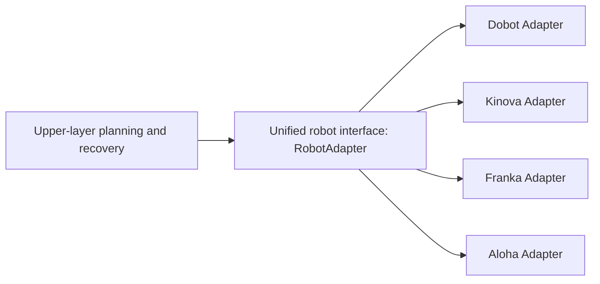

# ClawKep Robot Adaptation (Path B)

> Goal: integrate your own robot into ClawKep in an engineering-friendly way and make the full loop work reliably:
> `preflight -> scene understanding -> execution -> online monitoring -> failure recovery -> long-horizon tasks`.

---

## Why a Unified Interface Instead of Rewriting Per Robot



What this means:

1. The upper layers call only the unified interface and do not depend on any model-specific SDK.
2. Each robot needs only its own adapter implementation to plug into the same system.
3. Planning, monitoring, and recovery are reused automatically across robots.

---

## B.0 Adaptation Target

Align your robot backend with ClawKep's unified interface contract and action protocol.

Required interface contract:

1. `connect()`
2. `close()`
3. `get_runtime_state()`
4. `execute_action(action, execute_motion=False)`

Required action protocol:

1. `movej`
2. `movel`
3. `open_gripper`
4. `close_gripper`
5. `wait`

The runtime state must also be readable, including at least connection state, joints, end-effector pose, and gripper status.

---

## B.1 Create a New Robot Adapter (Example)

Recommended file: `ReKep/cellbot_adapter.py`

```python
from robot_adapter import RobotAdapter


class CellbotAdapter(RobotAdapter):
    def __init__(self, host: str, port: int | None = None):
        self.host = host
        self.port = port
        self._connected = False

    def connect(self):
        # 1) Establish the SDK / RPC / socket connection
        self._connected = True
        return {"ok": True, "driver": "cellbot_sdk", "host": self.host, "port": self.port}

    def close(self):
        # 2) Release the connection
        self._connected = False

    def get_runtime_state(self):
        # 3) Return normalized runtime state
        return {
            "source": "cellbot_sdk",
            "connected": self._connected,
            "busy": False,
            "faulted": False,
            "tool_pose": [],
            "joint_state": [],
            "gripper_closed": None,
            "gripper_position": None,
        }

    def execute_action(self, action, execute_motion=False):
        # 4) Handle the unified action protocol
        action_type = str(action.get("type", "")).lower()
        if not execute_motion:
            return {"ok": True, "executed": False, "dry_run": True, "action_type": action_type}

        if action_type == "movej":
            # Call your SDK: joint-space move
            pass
        elif action_type == "movel":
            # Call your SDK: Cartesian move
            pass
        elif action_type == "open_gripper":
            pass
        elif action_type == "close_gripper":
            pass
        elif action_type == "wait":
            pass
        else:
            raise RuntimeError(f"Unsupported action type: {action_type}")
        return {"ok": True, "executed": True, "action_type": action_type}
```

---

## B.2 Register Factory Dispatch So the System Can Find Your Adapter

Edit `ReKep/robot_factory.py`:

1. Add the import and construction logic for `CellbotAdapter`.
2. Add a new `robot_family` or `robot_driver` branch inside `create_robot_adapter(...)`.
3. Keep the default branches intact so existing robots are not affected.

---

## B.3 Wire Your Backend Into the Bridge Entry Point

Edit `ReKep/dobot_bridge.py` (the current release still uses this file as the bridge entry point):

1. Add your driver name to the supported driver list, for example `cellbot_sdk`.
2. Support your default host/port inside `resolve_runtime_hardware_profile(...)`.
3. Dispatch adapter creation to `CellbotAdapter`.
4. Extend `run_preflight(...)` with your own connection checks and blocker reporting.

---

## B.4 Camera Integration (If You Are Not Using the Default RealSense)

If you use a non-RealSense or proprietary camera:

1. Extend `ReKep/camera_factory.py` with your `camera_source` parsing and dispatch logic.
2. Create a camera adapter that returns a normalized `capture_rgbd()` output:
   - `rgb: np.ndarray`
   - `depth: np.ndarray`
   - `capture_info: dict`
3. Make sure depth units and coordinate conventions are documented clearly (meters vs. millimeters).

---

## B.5 Calibration Integration (Critical for Real Execution)

At minimum, maintain these three types of configuration:

1. `ReKep/real_calibration/<your_settings>.ini` for camera aliases and serials
2. `ReKep/real_calibration/<your_extrinsic>.py` for `CAMERA_CONFIGS`
3. `ReKep/real_calibration/realsense_config/realsense_calibration_<serial>_lastest.json`

If you are not using RealSense, keeping an equivalent structure is still recommended because it makes the existing workflow easier to reuse.

---

## B.6 Validation Commands (Run in Order)

1) Environment preflight

```bash
conda run -n rekep python ReKep/dobot_bridge.py preflight \
  --dobot_driver cellbot_sdk \
  --dobot_host <ROBOT_HOST> \
  --dobot_port <ROBOT_PORT> \
  --camera_source "<YOUR_CAMERA_SOURCE>" \
  --camera_profile <YOUR_PROFILE> \
  --camera_serial <YOUR_SERIAL> \
  --dobot_settings_ini ReKep/real_calibration/<your_settings>.ini \
  --camera_extrinsic_script ReKep/real_calibration/<your_extrinsic>.py \
  --realsense_calib_dir ReKep/real_calibration/realsense_config \
  --pretty
```

2) Scene QA pipeline

```bash
conda run -n rekep python ReKep/dobot_bridge.py scene_qa \
  --question "What manipulable objects are in the current scene?" \
  --dobot_driver cellbot_sdk \
  --dobot_host <ROBOT_HOST> \
  --dobot_port <ROBOT_PORT> \
  --camera_source "<YOUR_CAMERA_SOURCE>" \
  --camera_profile <YOUR_PROFILE> \
  --camera_serial <YOUR_SERIAL> \
  --pretty
```

3) Task dry-run

```bash
conda run -n rekep python ReKep/dobot_bridge.py execute \
  --instruction "Pick up the target and place it into the designated area" \
  --dobot_driver cellbot_sdk \
  --dobot_host <ROBOT_HOST> \
  --dobot_port <ROBOT_PORT> \
  --camera_source "<YOUR_CAMERA_SOURCE>" \
  --camera_profile <YOUR_PROFILE> \
  --camera_serial <YOUR_SERIAL> \
  --pretty
```

4) Small-scope live motion test

```bash
conda run -n rekep python ReKep/dobot_bridge.py execute \
  --instruction "Perform a small safe real-robot motion to validate connectivity" \
  --execute_motion \
  --dobot_driver cellbot_sdk \
  --dobot_host <ROBOT_HOST> \
  --dobot_port <ROBOT_PORT> \
  --camera_source "<YOUR_CAMERA_SOURCE>" \
  --camera_profile <YOUR_PROFILE> \
  --camera_serial <YOUR_SERIAL> \
  --pretty
```

5) Long-horizon task validation

```bash
conda run -n rekep python ReKep/dobot_bridge.py longrun_start \
  --instruction "Run a multi-stage long-horizon manipulation task and recover automatically on failure" \
  --dobot_driver cellbot_sdk \
  --dobot_host <ROBOT_HOST> \
  --dobot_port <ROBOT_PORT> \
  --camera_source "<YOUR_CAMERA_SOURCE>" \
  --camera_profile <YOUR_PROFILE> \
  --camera_serial <YOUR_SERIAL> \
  --pretty
```

---

## B.7 Notes and Common Pitfalls

1. The default is `execute_motion=false`; start with dry-run.
2. Validate `movel` units first (mm+deg or m+rad) before running live.
3. Re-run preflight whenever calibration changes.
4. Before testing long-horizon tasks, first validate a short task that can fail safely.
5. Keep logs and state files for every run so you can replay and debug later.
