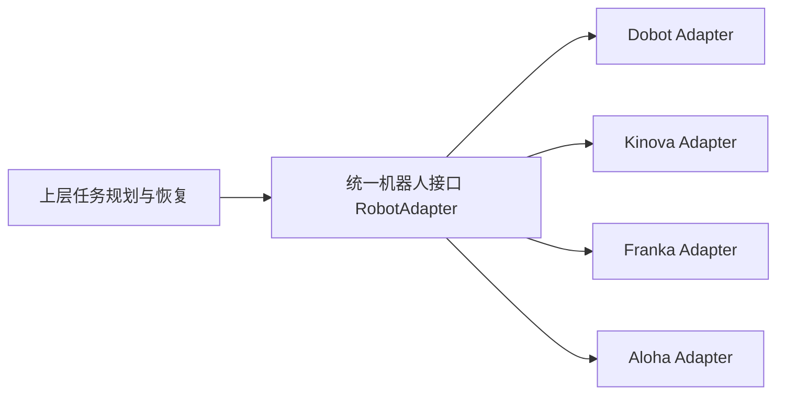

# ClawKep 机器人适配（路径 B）

> 目标：让你把自己的机器人以工程化方式接入 ClawKep，并稳定跑通  
> `预检 -> 场景理解 -> 执行 -> 在线监控 -> 失败恢复 -> 长程任务`。

---

## 为什么是“统一接口”而不是“逐机器人重写”



上图表示：

1. 上层只调用统一接口，不直接依赖任何型号 SDK。
2. 每种机械臂只需要实现自己的 Adapter，即可接入同一系统能力。
3. 任务规划、监控、恢复能力天然复用，不随机器人重复开发。

---

## B.0 适配目标

把你的机器人后端对齐到 ClawKep 的统一接口契约与动作协议：

统一接口契约（必须）：

1. `connect()`
2. `close()`
3. `get_runtime_state()`
4. `execute_action(action, execute_motion=False)`

统一动作协议（必须）：

1. `movej`
2. `movel`
3. `open_gripper`
4. `close_gripper`
5. `wait`

并且保证运行态信息可回读（连接、关节、末端位姿、夹爪状态）。

---

## B.1 新建机器人适配器（示例）

建议新建：`ReKep/cellbot_adapter.py`

```python
from robot_adapter import RobotAdapter


class CellbotAdapter(RobotAdapter):
    def __init__(self, host: str, port: int | None = None):
        self.host = host
        self.port = port
        self._connected = False

    def connect(self):
        # 1) 建立 SDK / RPC / Socket 连接
        self._connected = True
        return {"ok": True, "driver": "cellbot_sdk", "host": self.host, "port": self.port}

    def close(self):
        # 2) 释放连接
        self._connected = False

    def get_runtime_state(self):
        # 3) 返回标准化运行态
        return {
            "source": "cellbot_sdk",
            "connected": self._connected,
            "busy": False,
            "faulted": False,
            "tool_pose": [],
            "joint_state": [],
            "gripper_closed": None,
            "gripper_position": None,
        }

    def execute_action(self, action, execute_motion=False):
        # 4) 统一处理动作协议
        action_type = str(action.get("type", "")).lower()
        if not execute_motion:
            return {"ok": True, "executed": False, "dry_run": True, "action_type": action_type}

        if action_type == "movej":
            # 调你的 SDK: Joint move
            pass
        elif action_type == "movel":
            # 调你的 SDK: Cartesian move
            pass
        elif action_type == "open_gripper":
            pass
        elif action_type == "close_gripper":
            pass
        elif action_type == "wait":
            pass
        else:
            raise RuntimeError(f"Unsupported action type: {action_type}")
        return {"ok": True, "executed": True, "action_type": action_type}
```

---

## B.2 注册工厂分发（让系统能找到你的适配器）

编辑 `ReKep/robot_factory.py`：

1. 新增 `CellbotAdapter` 的导入与构造逻辑。
2. 在 `create_robot_adapter(...)` 中加入新 `robot_family` 或新 `robot_driver` 分支。
3. 保留默认分支，避免影响已上线机器人。

---

## B.3 桥接参数接入（让命令行可选你的后端）

编辑 `ReKep/dobot_bridge.py`（当前发布版桥接入口仍使用该文件名）：

1. 在驱动白名单中加入你的驱动名（如 `cellbot_sdk`）。
2. 在 `resolve_runtime_hardware_profile(...)` 中支持你的默认 host/port。
3. 在创建 adapter 的路径中分发到你的 `CellbotAdapter`。
4. 在 `run_preflight(...)` 加入你的连接探测逻辑和阻塞项信息。

---

## B.4 相机接入（如不是默认 RealSense）

如果你用的是非 RealSense 或专有相机：

1. 在 `ReKep/camera_factory.py` 增加你的 `camera_source` 解析与分发。
2. 新建相机 adapter，返回统一 `capture_rgbd()` 输出：
   - `rgb: np.ndarray`
   - `depth: np.ndarray`
   - `capture_info: dict`
3. 确保深度单位与坐标系在文档中明确（米/毫米）。

---

## B.5 标定接入（真实执行的关键）

至少维护三类配置：

1. `ReKep/real_calibration/<your_settings>.ini`（相机别名与 serial）
2. `ReKep/real_calibration/<your_extrinsic>.py`（`CAMERA_CONFIGS`）
3. `ReKep/real_calibration/realsense_config/realsense_calibration_<serial>_lastest.json`

如果你不是 RealSense，也建议保持等价结构，方便复用现有流程。

---

## B.6 验证命令（按顺序执行）

1) 环境预检

```bash
conda run -n rekep python ReKep/dobot_bridge.py preflight \
  --dobot_driver cellbot_sdk \
  --dobot_host <ROBOT_HOST> \
  --dobot_port <ROBOT_PORT> \
  --camera_source "<YOUR_CAMERA_SOURCE>" \
  --camera_profile <YOUR_PROFILE> \
  --camera_serial <YOUR_SERIAL> \
  --dobot_settings_ini ReKep/real_calibration/<your_settings>.ini \
  --camera_extrinsic_script ReKep/real_calibration/<your_extrinsic>.py \
  --realsense_calib_dir ReKep/real_calibration/realsense_config \
  --pretty
```

2) 场景问答链路

```bash
conda run -n rekep python ReKep/dobot_bridge.py scene_qa \
  --question "当前画面里有哪些可操作物体？" \
  --dobot_driver cellbot_sdk \
  --dobot_host <ROBOT_HOST> \
  --dobot_port <ROBOT_PORT> \
  --camera_source "<YOUR_CAMERA_SOURCE>" \
  --camera_profile <YOUR_PROFILE> \
  --camera_serial <YOUR_SERIAL> \
  --pretty
```

3) 任务 dry-run

```bash
conda run -n rekep python ReKep/dobot_bridge.py execute \
  --instruction "抓取目标并放置到指定区域" \
  --dobot_driver cellbot_sdk \
  --dobot_host <ROBOT_HOST> \
  --dobot_port <ROBOT_PORT> \
  --camera_source "<YOUR_CAMERA_SOURCE>" \
  --camera_profile <YOUR_PROFILE> \
  --camera_serial <YOUR_SERIAL> \
  --pretty
```

4) 小范围真机动作

```bash
conda run -n rekep python ReKep/dobot_bridge.py execute \
  --instruction "做一个小幅安全动作进行真机连通验证" \
  --execute_motion \
  --dobot_driver cellbot_sdk \
  --dobot_host <ROBOT_HOST> \
  --dobot_port <ROBOT_PORT> \
  --camera_source "<YOUR_CAMERA_SOURCE>" \
  --camera_profile <YOUR_PROFILE> \
  --camera_serial <YOUR_SERIAL> \
  --pretty
```

5) 长程任务验证

```bash
conda run -n rekep python ReKep/dobot_bridge.py longrun_start \
  --instruction "执行一个包含多子任务的长程操作，并在失败时自动恢复" \
  --dobot_driver cellbot_sdk \
  --dobot_host <ROBOT_HOST> \
  --dobot_port <ROBOT_PORT> \
  --camera_source "<YOUR_CAMERA_SOURCE>" \
  --camera_profile <YOUR_PROFILE> \
  --camera_serial <YOUR_SERIAL> \
  --pretty
```

---

## B.7 注意事项

1. 默认 `execute_motion=false`，先 dry-run。
2. 先验证 `movel` 单位一致性（mm+deg 或 m+rad）再跑真机。
3. 标定参数更新后必须重新 preflight。
4. 长程任务前先跑一个可回退的短任务。
5. 每次执行都保留日志路径和状态文件，便于回放与复盘。
